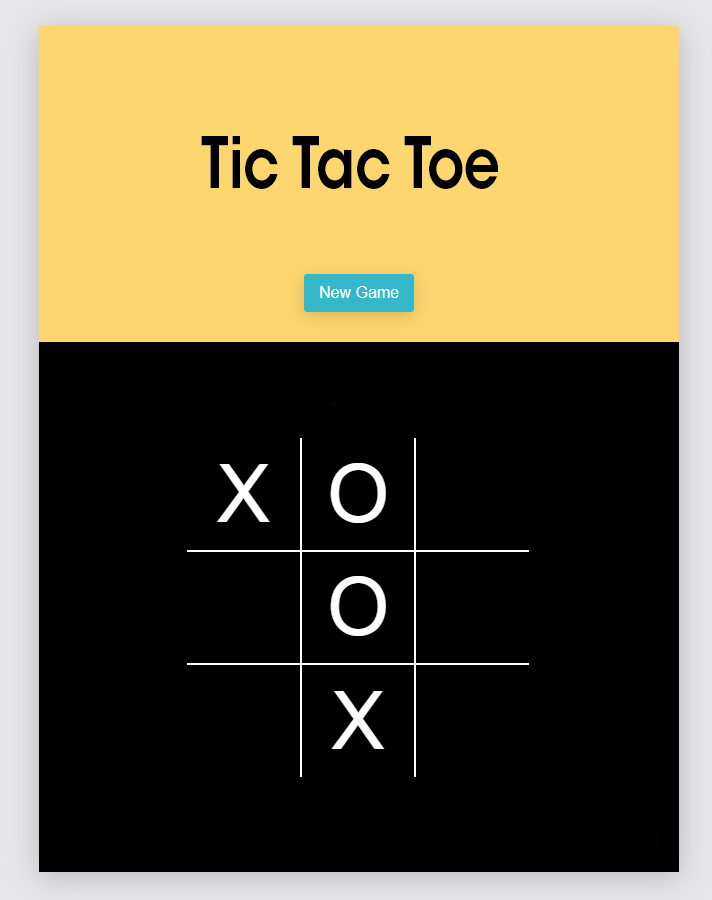

# 3.Hafta Ödevi

## Tic Tac Toe Oyunu

2 kişinin oynayabileceği bir Tic Tac Toe oyunu yapmanızı bekliyoruz. Tasarımı size kalmakla birlikte referans olması açısından bir görsel ekledik.

## Yararlandığım kaynaklar

- [freeCodeCamp](https://www.freecodecamp.org/news/learn-how-to-build-tic-tac-toe-with-react-hooks/)
- [React Tutorial](https://tr.reactjs.org/tutorial/tutorial.html)
- [Medium](https://medium.com/@shifrb/how-to-build-tic-tac-toe-with-react-hooks-ca37f6040022)

## Aldığım hata hakkında paylaşımım/çözümüm:

- [Stackoverflow (TypeError)](https://stackoverflow.com/questions/64576910/solved-react-js-typeerror-cannot-read-property-0-of-undefined-tic-tac-toe/)

## Ekran Goruntusu

### Oyun Akışı

- Kullanıcı hamlelerinden birisi "X" ile ifade edilirken, diğeri "O" ile ifade edilecek.
- Tıklama aksiyonunda sıralamaya göre "X" veya "O" ekleme işlemi yapılacak.
- Dikey, yatay veya çapraz olarak aynı tipteki ikonları sıralayabilen oyuncu oyunu kazanır.
- Kazanma, kaybetme ve beraberlik durumlarında sonuç ekranda gösterilecek.

Detaylı oyun kuralları için [tıklayabilirsiniz](https://www.exploratorium.edu/brain_explorer/tictactoe.html).

## Kurulum

Projeyi lokalde çalıştırabilmek için:

- Repo'yu klonlayın `git clone https://github.com/ReactBootcamp66/tic-tac-toe-odevi.git`
- Komutu çalıştırın `cd tic-tac-toe`
- Komutu çalıştırın `npm install` veya `yarn install`
- Komutu çalıştırın `npm start` veya `yarn install`
