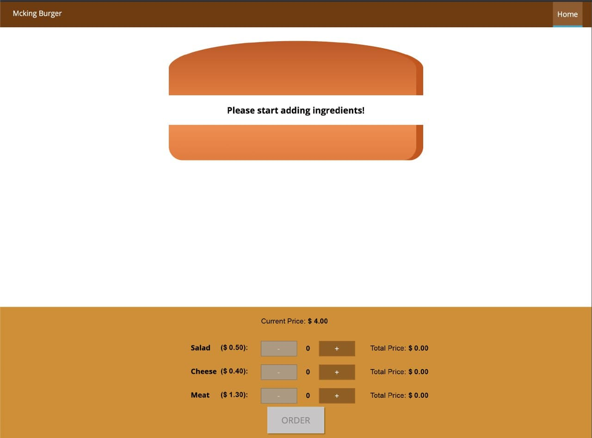
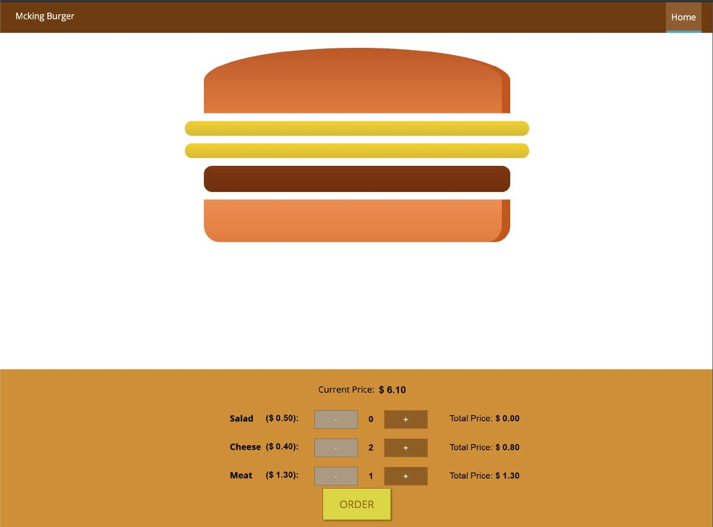
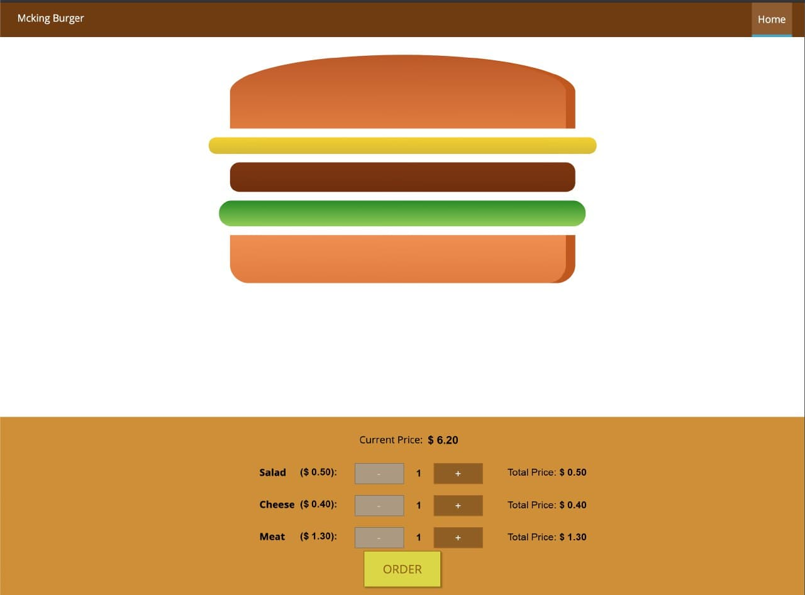

# Mcking Burger

Bu ödevde online hamburger siparişi verebileceğimiz bir sistem yapacağız.

## Yararlandığım Kaynaklar

- [Stackoverflow](https://stackoverflow.com/questions/tagged/reactjs)
- [YouTube](https://www.youtube.com/watch?v=hs9C0iSnaNk)
- [Medium](https://medium.com/@olinations/10-steps-to-convert-a-react-class-component-to-a-functional-component-with-hooks-ab198e0fa139)

## Kullandığım paketler

- [React Router](https://reactrouter.com/)
- [React-Reveal](https://www.react-reveal.com/)
- [React Icons](https://react-icons.github.io/react-icons/)
- [React SVGR](https://react-svgr.com/)
- [SASS](https://sass-lang.com/)

## Sistemin ekran görüntüsü


## Giriş

Mcking Burger adında bir şirketimiz var ve buradan müşterilerimizin online hamburger verebilmesini istiyoruz.

Not: Ödevde ihtiyaç duyduğunuz bilgileri `alt tarafta` ekledik.

- Hamburger tasarımı için gerekli olan css kodları
- Sizden beklediğimiz sonucun ekran görüntüleri

## İstenilenler

- 2 sayfadan oluşmalıdır.
  -- Anasayfa: Hamburgeri oluşturma işlemini yapıp ve siparişi tamamla diyebilmelidir.
  -- Sonuç ekranı: Vermiş olduğu siparişin son hali ve bir mesaj(Ör: 'Siparişiniz başarı bir şekilde oluşturuldu.' diyebilirsiniz. )
- Müşteri istediği kadar salata, peynir ve et ekleyebilmelidir. Seçilen ürünler sırasıyla peynir, salata ve et olacak şekilde dizilmelidir.

  **Ör-1:** Müşteri 2 tane peynir ve 1 et seçtiyse;

  ```html
  <div class="burger">
    <div class="bread-top"></div>
    <div class="cheese"></div>
    <div class="cheese"></div>
    <div class="meat"></div>
    <div class="bread-bottom"></div>
  </div>
  ```

  **Ör-2:** Müşteri 1 tane peynir, 1 adet salata ve 1 et seçtiyse;

  ```html
  <div class="burger">
    <div class="bread-top"></div>
    <div class="cheese"></div>
    <div class="salad"></div>
    <div class="meat"></div>
    <div class="bread-bottom"></div>
  </div>
  ```

  **Ekran görüntüleri en alttadır.**

- Eklenen ürünlerin birim fiyatları olacak ve altta bu toplam fiyat gösterilmelidir.

## Ürün bilgileri

Ürünlerin birim fiyatları alttaki gibidir.

```js
const INGREDIENT_UNIT_PRICES = {
  salad: 0.5,
  cheese: 0.4,
  meat: 1.3
}
```

**Sipariş Başlangıç Tutarı: 4.00'dür** ve eklenen her ürün hesaplanıp(**adet \* birim fiyat**) başlangıç fiyatının üstüne eklenmelidir.

## Yardımcı css kuralları

```css
.burger {
  width: 700px;
  height: 600px;
}

.bread-top {
  height: 20%;
  width: 80%;
  background: linear-gradient(#bc581e, #e27b36);
  border-radius: 50% 50% 0 0;
  box-shadow: inset -15px 0 #c15711;
  margin: 2% auto;
  position: relative;
}

.bread-bottom {
  height: 13%;
  width: 80%;
  background: linear-gradient(#f08e4a, #e27b36);
  border-radius: 0 0 30px 30px;
  box-shadow: inset -15px 0 #c15711;
  margin: 2% auto;
}

.salad {
  width: 85%;
  height: 7%;
  margin: 2% auto;
  background: linear-gradient(#228c1d, #91ce50);
  border-radius: 20px;
}

.cheese {
  width: 90%;
  height: 4.5%;
  margin: 2% auto;
  background: linear-gradient(#f4d004, #d6bb22);
  border-radius: 20px;
}

.meat {
  width: 85%;
  height: 7%;
  margin: 2% auto;
  background: linear-gradient(#228c1d, #91ce50);
  border-radius: 20px;
}
```

## Ekran Görüntüleri

### Başlangıç Noktası



### Örnek-01



### Örnek-02


